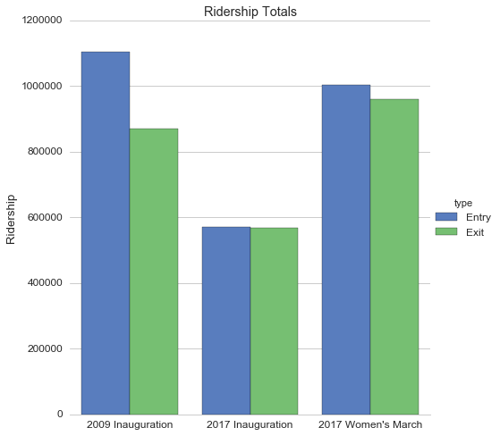

WMATA Ridership Data
===

> Intraday ridership data from Washington Metro Area Transit Authority for 2009 and 2017 inaugurations and the Women's March.

## Description

On Jan. 23, 2017, we filed a request under WMATA's [Public Access to Records Policy](https://www.wmata.com/about/records/) for Metrorail station hourly entrance and exit data for Obama's inauguration on Jan. 20, 2009, Trump's inauguration on Jan. 20, 2017, and the Women's March on Jan. 21, 2017.

On Feb. 2, 2017, we received data for those days broken down into five time periods:

* AM Peak: Station Opening to 9:30 AM.
* Mid-day: 9:30 AM – 3:00 PM.
* PM Peak: 3:00 PM- 7:00 PM.
* Evening: 7:00 PM to Station Closing.

## Files

The data was provided to us in two PDFs:

* [PARP 17-0016 Inauguration Records.pdf](ridership-data/PARP 17-0016 Inauguration Records.pdf)
* [PARP 17-0016 Women-s March Record.pdf](ridership-data/PARP 17-0016 Women-s March Record.pdf)

We used Tabula to turn these PDFs into spreadsheet data. One of the pages in `PARP 17-0016 Inauguration Records.pdf` was not convertible so we used ABBYY for that page. The data with minor post-OCR clean up is here:

* [2009-Inauguration-Records-Raw.csv](ridership-data/2009-Inauguration-Records-Raw.csv)
* [2017-Inauguration-Records-Raw.csv](ridership-data/2017-Inauguration-Records-Raw.csv)
* [2017-Womens-March-Records-Raw.csv](ridership-data/2017-Womens-March-Records-Raw.csv)

We did the following cleaning to make this data easier to use. See [Jupyter Notebook](wmata-ridership.ipynb) for more details.

- [x] Combine station data from the three speadsheets into one
- [x] Removed commas from numeric entries
- [x] Split event `event_date` column into two columns `date` and `day`
- [x] Added `event_name` column
- [x] Merged station names like `Brookland-CU` with `Brookland/CUA` and `U Street-Cardozo` with `U Street/Cardozo`
- [x] Split out `SYSTEMWIDE TOTALS` data into into its own spreadsheet
- [x] Verified row totals

The two cleaned speadsheets (station data and system-wide totals) can be found here:

* [Inauguration-Womens-March-Records-Clean.csv](ridership-data/Inauguration-Womens-March-Records-Clean.csv)
* [Inauguration-Womens-March-Totals.csv](ridership-data/Inauguration-Womens-March-Totals.csv)

## Why are exits lower than entrances?

From WMATA press office:

> To safely manage crowds during periods of high volume, Metro staff occasionally opened faregates, allowing customers to exit the system faster without processing fare media. (In these cases, the cards are reset and fares are charged as a batch process.) The “entry” number is what is used for official ridership stats.

## Other files

If you want to make a map of this data, you might find these shapefiles helpful.

* Stations
  - Go to http://opendata.dc.gov and search for `Metro Stations (Regional)`
  - Direct shapefile download http://opendata.dc.gov/datasets/e3896b58a4e741d48ddcda03dae9d21b_51.zip
* Lines
  - Go to http://opendata.dc.gov and search for `Metro Lines (Regional)`
  - Direct shapefile download http://opendata.dc.gov/datasets/ead6291a71874bf8ba332d135036fbda_58.zip

## Disclaimer

We have done our best to verify the that the CSV data matches the PDF data including checking sums and manually comparing each row. However, errors may persist. Do your own checking to ensure its integrity. If you find any errors, please [file an issue](https://github.com/bizweekgraphics/wmata-ridership-data/issues).

## Attribution

PDFs should be cited as `WMATA data obtained by Bloomberg News`.

The provided CSV files should be cited as `Bloomberg News analysis of WMATA data`.
